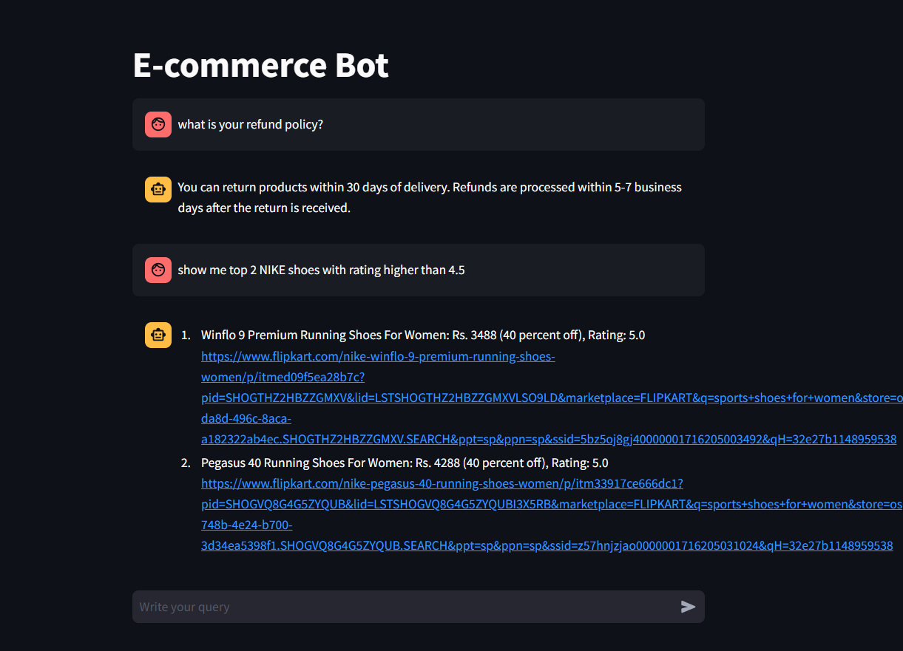
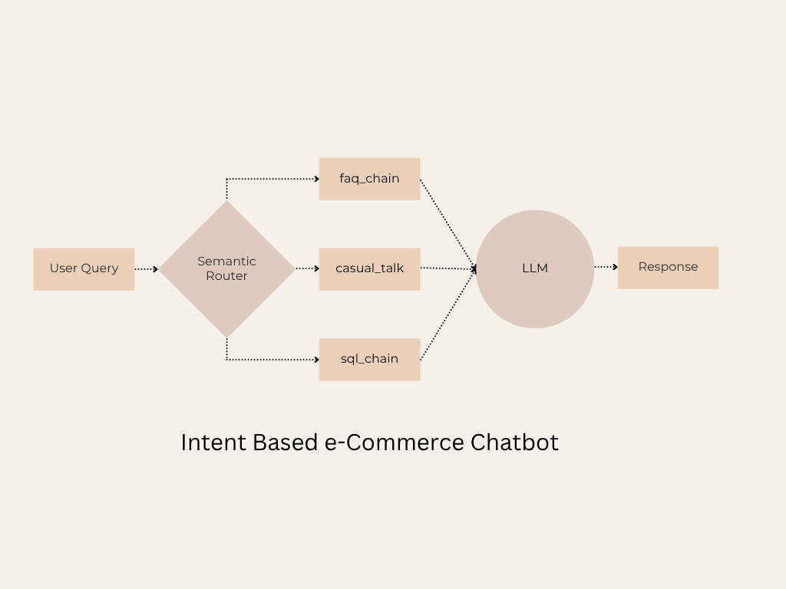

# E-commerce Chatbot

This is an interactive **E-commerce Chatbot** built using Python and Streamlit. The chatbot is designed to assist users with FAQs, product-related queries, and small talk. It leverages Query routing to route user queries to the appropriate module and provide accurate responses.

---

## Features

- **FAQ Handling**: Provides answers to frequently asked questions about policies, payment methods, shipping, and more.
- **SQL Query Generation**: Dynamically generates and executes SQL queries to fetch product-related data from a database.
- **Small Talk**: Engages in friendly conversations with users.
- **Interactive UI**: Built with Streamlit for a seamless and user-friendly chat interface.

---

## Folder structure

```bash 
    app/
    ├── .env # Environment variables (keep secret info here)
    ├── db.sqlite # SQLite database (can be added to .gitignore if not needed in the repo)
    ├── faq.py # FAQ handling logic
    ├── main.py # Entry point for the chatbot application
    ├── resources/
    │ ├── faq_data.csv # FAQ data for ingestion
    ├── router.py # Query routing logic
    ├── small_talk.py # Small talk handling logic
    ├── sql.py # SQL query generation and execution logic
    ├── requirements.txt # Project dependencies (e.g., Streamlit, pandas)
    └── README.md # Project overview and usage instructions
```
---



---

## Architecture


---


### Set-up & Execution

1. Clone the repository:

    ```bash
    git clone https://github.com/Apurv-Mahamuni/E-Commerce-chatbot
    cd E-Commerce-chatbot
    ```

2. Install dependencies:
    ```bash
    pip install -r requirements.txt
    ```

3. Set up the environment variables:

    Create a .env file in the app/ directory.
    Add the following variables

    ```text
    GROQ_API_KEY=your_api_key
    GROQ_MODEL=your_groq_model_id
    ```

4. Run the application:
    ```bash
    streamlit run app/main.py
    ```

---


## Technologies Used

- **Python**: Core programming language.
- **Streamlit**: For building the interactive user interface.
- **SQLite**: Database for storing product data.
- **ChromaDB**: Vector database for efficient FAQ retrieval.
- **Groq**: LLM model for generating responses.